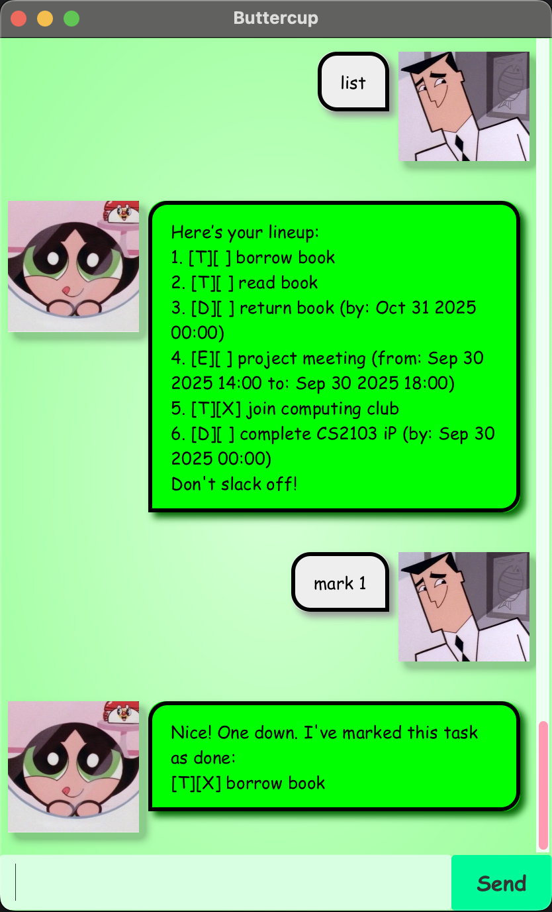

# Buttercup User Guide



Buttercup Chatbot is a task management assistant styled after the feisty Powerpuff Girl. It helps users create and track
todos, deadlines, and events, while keeping task completion in check. Designed with keyboard-focused users in mind, it
blends the speed of a command-line interface with the clarity of a graphical display, offering both efficient input and 
visually engaging output.

- [Quick Start](#quick-start)
- [Features](#features)
  - [Viewing help: `help`](#view-help)
  - [Listing all tasks: `list`](#list-tasks)
  - [Adding todos: `todo`](#add-todos)
  - [Adding deadlines: `deadline`](#add-deadlines)
  - [Adding events: `event`](#add-events)
  - [Marking task complete: `mark`](#mark-task)
  - [Marking task incomplete: `unmark`](#unmark-task)
  - [Deleting a task: `delete`](#delete-task)
  - [Locating tasks by description: `find`](#find-task)
  - [Exiting the program: `bye`](#exit)
  - [Saving the data](#save-data)
  - [Editing the data file](#edit-data)
- [FAQ](#faq)
- Command Summary

## <a name="quick-start">Quick Start</a>
1. Ensure you have Java `17` or above installed on your Computer\
**Mac users:** Ensure you have the precise JDK version prescribed 
[here](https://se-education.org/guides/tutorials/javaInstallationMac.html)


2. Download the latest `.jar` file from [here](https://github.com/jvvvstin/ip/releases)


3. Copy the file to the folder you want to use as the _home folder_ for your Buttercup chatbot


4. Open a command terminal, `cd` into the folder you put the jar file in 


5. Run the application:
   - For GUI, use `java -jar buttercup.jar`
   - For CLI, use `java -jar buttercup.jar --console`


6. Type a command in the input box and press Enter to execute it, e.g. typing `help` and pressing Enter will display a
list of existing commands\
Some example commands you can try:
   - `list` - Lists all current tasks
   - `deadline return book /by 2025-01-30 1800`: Adds a Deadline task called `return book` which has a deadline of
     `30 Jan 2025 18:00` to the list of current tasks
   - `delete 3`: Deletes the 3rd task shown in the current task list
   - `mark 3`: Marks the 3rd task shown in the current task list as completed
   - `bye`: Exits the app


7. Refer to the [Features](#features) below for details of each command

## <a name="features">Features</a>
### <a name="view-help">Viewing help: `help`</a>
Shows a message displaying the list of existing commands
```
help
____________________________________________________________
Hello, I am Buttercup!
I can help you keep track of all your ToDos, Deadlines and Events!
Here is a list of available commands:
1. help - Get a list of available commands
2. bye - Exit the application
3. list - List all tasks
4. todo {description} - Create a new ToDo task
5. deadline {description} /by {date} - Create a new Deadline task
6. event {description} /from {date} /to {date} - Create a new Event task
7. mark {task number} - Mark a task as complete
8. unmark {task number} - Unmark a task as incomplete
9. delete {task number} - Delete a task
10. find {keyword} - Find tasks containing the keyword

Proceed to track your tasks now! :D
____________________________________________________________
```
Format: `help`

### <a name="list-tasks">Listing all tasks: `list`</a>
Shows a list of all tasks in the task list

Format: `list`

Output:
```
list
____________________________________________________________
Here’s your lineup:
1. [T][ ] read book
2. [D][X] return book (by: Sep 30 2025 00:00)
3. [E][ ] project meeting (from: Aug 06 2025 14:00 to: Aug 06 2025 16:00)
Don't slack off!
____________________________________________________________
```

### <a name="add-todos">Adding todos: `todo`</a>
Adds a todo task to the task list

Format: `todo {description}`

Examples:
- `todo borrow book` adds a todo task called `borrow book`
- `todo complete quiz` adds a todo task called `complete quiz`

Output:
```
todo borrow book
____________________________________________________________
Boom. Task added:
[T][ ] borrow book
Now you have 1 task in the list.
____________________________________________________________
```

### <a name="add-deadlines">Adding deadlines: `deadline`</a>
Adds a deadline task to the task list

Format: `deadline {description} /by {date}`
- `date` should be of the format `yyyy-MM-dd HHmm` or `d/M/yyyy HHmm`

Examples:
- `deadline return book /by 2025-09-30 0000` adds a deadline task called `return book` which has a deadline of 
`Sep 30 2025 00:00`
- `deadline complete CS2103 quiz 6 /by 30/9/2025 1800` adds a deadline task called `complete CS2103 quiz 6` which has a
deadline of `Sep 30 2025 18:00`

Output:
```
deadline return book /by 2025-09-30 0000
____________________________________________________________
Boom. Task added:
[D][ ] return book (by: Sep 30 2025 00:00)
Now you have 2 tasks in the list.
____________________________________________________________
```

### <a name="add-events">Adding events: `event`</a>
Adds an event task to the task list

Format: `event {description} /from {date} /to {date}`
- `date` should be of the format `yyyy-MM-dd HHmm` or `d/M/yyyy HHmm`

Examples:
- `event project meeting /from 2025-08-06 1400 /to 2025-08-06 1600` adds an event task called `project meeting` which
takes place from `Aug 06 2025 14:00` to `Aug 06 2025 16:00`
- `event birthday dinner /from 7/10/2025 1800 /to 7/10/2025 2200` adds an event task called `birthday dinner` which
takes place from `Oct 07 2025 18:00` to `Oct 07 2025 22:00`

Output:
```
event project meeting /from 2025-08-06 1400 /to 2025-08-06 1600
____________________________________________________________
Boom. Task added:
[E][ ] project meeting (from: Aug 06 2025 14:00 to: Aug 06 2025 16:00)
Now you have 3 tasks in the list.
____________________________________________________________
```

### <a name="mark-task">Marking task complete: `mark`</a>
Marks the specified task in the task list as complete

Format: `mark {task number}`
- marks the task at the specified `{task number}` as complete
- the task number refers to the task number shown in the displayed task list
- the task number **must be a positive integer** 1, 2, 3, ...

Example:
- `list` followed by `mark 2` marks the 2nd task in the task list as complete

Output:
```
mark 2
____________________________________________________________
Nice! One down. I've marked this task as done:
[D][X] return book (by: Sep 30 2025 00:00)
____________________________________________________________
```

### <a name="unmark-task">Marking task incomplete: `unmark`</a>
Marks the specified task in the task list as incomplete

Format: `unmark {task number}`
- marks the task at the specified `{task number}` as incomplete
- the task number refers to the task number shown in the displayed task list
- the task number **must be a positive integer** 1, 2, 3, ...

Example:
- `list` followed by `unmark 2` marks the 2nd task in the task list as incomplete

Output:
```
unmark 2
____________________________________________________________
Uh-oh, bringing that one back:
[D][ ] return book (by: Sep 30 2025 00:00)
____________________________________________________________
```

### <a name="delete-task">Deleting a task: `delete`</a>
Deletes the specified task from the task list

Format: `delete {task number}`
- Deletes the task at the specified task number
- the task number refers to the task number shown in the displayed task list
- the task number **must be a positive integer** 1, 2, 3, ...

Examples:
- `list` followed by `delete 2` deleted the 2nd task in the task list

Output:
```
delete 2
____________________________________________________________
Task obliterated:
[D][ ] return book (by: Sep 30 2025 00:00)
____________________________________________________________
```

### <a name="find-task">Locating tasks by description: `find`</a>
Find tasks whose description contains the given keyword

Format: `find {keyword}`
- the search is case-insensitive, e.g. `books` will match `Books`
- only the task description is searched

Examples:
- `find book` returns `read book` and `return book`
- `find Meeting` returns `project meeting`

Output:
```
find book
____________________________________________________________
Tasks with that word? Right here:
1. [T][ ] read book
2. [D][X] return book (by: Sep 30 2025 00:00)
____________________________________________________________
```

### <a name="exit">Exiting the program: `bye`</a>
Exits the program

Format: `bye`

Output:
```
bye
____________________________________________________________
Bye. Hope to see you again soon!
____________________________________________________________
```

### <a name="save-data">Saving the data</a>
Buttercup tasks data are saved in the hard disk automatically after any command that changes the data.\
There is no need to save manually.

### <a name="edit-data">Editing the data file</a>
Buttercup tasks data are saved automatically as a txt file `[JAR file location]/data/tasks.txt`. Advanced users are
welcomed to update data directly by editing that data file.

> [!CAUTION]
> If your changes to the data file makes its format invalid, Buttercup will discard all invalid lines and potentially
> start with an empty data file. Hence, it is recommended to take a backup of the file before editing it.\
> Furthermore, certain edits can cause Buttercup to behave in unexpected ways (e.g. if a value entered is outside of 
> the acceptable range). Therefore, edit the data file only if you are confident that you can update it correctly.

## <a name="faq">FAQ</a>
**Q:** How do I transfer my data to another Computer?
**A:** Install the app in the other computer and overwrite the empty data file it creates with the file that contains
the data of your Buttercup home folder

## <a name="command-summary">Command Summary</a>
| Action       | Format, Examples                                                                                                         |
|:-------------|:-------------------------------------------------------------------------------------------------------------------------|
| **Help**     | `help`                                                                                                                   |
| **List**     | `list`                                                                                                                   |
| **Todo**     | `todo {description}`<br/>e.g. `todo borrow book`                                                                         |
| **Deadline** | `deadline {description} /by {date}`<br/>e.g. `deadline return book /by 2025-09-30 0000`                                  |
| **Event**    | `event {description} /from {date} /to {date}`<br/>e.g. `event project meeting /from 2025-08-06 1400 /to 2025-08-06 1600` |
| **Mark**     | `mark {task number}`<br/>e.g. `mark 2`                                                                                   |
| **Unmark**   | `unmark {task number}`<br/>e.g. `unmark 2`                                                                               |
| **Delete** | `delete {task number}`<br/>e.g. `delete 2`                                                                               |
| **Find** | `find {keyword}`<br/>e.g. `find book`                                                                                    |
| **Exit** | `bye`                                                                                                                    |